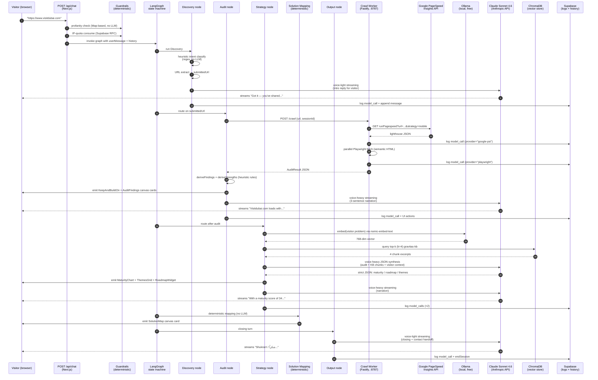

# Session flow — what happens when a visitor sends a message

This is the canonical reference for "where does this turn go and what does it call?". It's referenced from `CLAUDE.md`, `docs/AGENTS.md` and the admin **Flow** page (`/admin/sessions/<id>/flow`).

> One visitor message → one or many agent runs. A bare "hi" runs Discovery only. A URL audit runs five nodes in sequence with seven external calls. The router does the same thing each time — only the conditional edges change.

## End-to-end diagram

## What each node does

### Discovery — `src/agents/nodes/discovery.ts`

1. **Heuristic intent classifier** (`heuristicIntent`) — regex over the user's message → one of `problem-statement | gravitas-question | meta-question | off-topic`. Pure, no LLM.
2. **Visitor patch extraction** (`extractVisitorPatchHeuristic`) — pulls a URL out if present AND audit intent is clear; pulls a `namedProblem` quote if the message is substantive. Pure.
3. **Streamed reply** via Claude voice-light. For `gravitas-question` intent, embeds the visitor's query via Ollama → queries the KB → grounds Claude on top-k chunks. Otherwise streams a templated voice with the system prompt set per intent.

Logs in `model_calls`:
- `embed · ollama · nomic-embed-text` (only for gravitas-question with chunks)
- `voice-light · anthropic · claude-sonnet-4-6`

### Audit — `src/agents/nodes/audit.ts`

1. Consumes one audit from the per-IP quota (`consumeAudit`). If exhausted, emits `RateLimitReached` and bails.
2. Calls `crawlUrl` → worker `/crawl`. Worker runs PSI + Playwright in parallel.
3. **Heuristic findings derivation** (`deriveFindings`, `deriveStrengths`) — pure rules over the AuditResult. No LLM.
4. Emits canvas cards: `KeepAndBuildOn` (positive observations first, per Gravitas methodology), `AuditFindings` (severity-sorted).
5. Streamed 3-sentence narration via Claude voice-heavy.

Logs in `model_calls`:
- `lighthouse · google-psi · lighthouse-v6 · perf X · a11y Y` ← **new**
- `crawl · playwright · chromium-131 · N words · h1×K` ← **new**
- `voice-heavy · anthropic · claude-sonnet-4-6`

### Strategy — `src/agents/nodes/strategy.ts`

1. Best-effort KB grounding — embeds the visitor's named problem (or the audit URL) via Ollama → queries ChromaDB for top-k chunks. Used as system-prompt context for Claude.
2. **JSON synthesis** via Claude voice-heavy — strict schema (`ClaudeStrategyJson`). On parse failure, retries once with a stricter wrapper; if both fail, deterministic fallback from audit data alone.
3. Emits `MaturityChart`, `ThemesGrid`, `RoadmapWidget`.
4. Streamed 3-sentence narration via Claude voice-heavy.

Logs in `model_calls`:
- `embed · ollama · nomic-embed-text`
- `voice-heavy · anthropic · claude-sonnet-4-6` (JSON)
- `voice-heavy · anthropic · claude-sonnet-4-6` (narration)

### Solution Mapping — `src/agents/nodes/solution-mapping.ts`

Pure deterministic transform: roadmap items grouped by `gravitasService` tag → `SolutionMap` canvas action. **No LLM call**.

### Output — `src/agents/nodes/output.ts`

Single Claude voice-light streamed turn. 4 sentences — headline finding + maturity score, what a full engagement would do, named-contact handoff, bilingual "Shukran! / شكراً" close. Picks contact name/email from `BRANDING_CLOSING_CONTACT_*` env vars (falls back to "the Gravitas team at hello@thisisgravitas.com").

Logs in `model_calls`:
- `voice-light · anthropic · claude-sonnet-4-6`

### Conditional terminals

- **Cap Reached** (`src/agents/nodes/cap-reached.ts`) — fires when any Claude call throws `DailyCapExceeded` (router refuses voice-heavy calls past the day's `$50` cap). Emits a `CapReached` card with hardcoded copy. No LLM call.
- **Rate Limit Reached** — emitted directly from `app/api/chat/route.ts` when `consumeTurn`/`consumeAudit` reject. Visitor sees a `RateLimitReached` card. No node fires.

## Model routing — which model runs which purpose

Source of truth: `src/lib/models/router.ts`.

| Purpose | Provider | Model | When |
|---|---|---|---|
| `voice-light` | Anthropic | Claude Sonnet 4.6 | Discovery turns, Output close. Silently swaps to Ollama DeepSeek-R1 when daily cap exhausted. |
| `voice-heavy` | Anthropic | Claude Sonnet 4.6 | Audit narration, Strategy JSON + narration. Refuses with `DailyCapExceeded` past cap — never silently downgrades. |
| `intent` | Ollama | Qwen3 | (currently bypassed — Phase 1 uses heuristic) |
| `embed` | Ollama | nomic-embed-text | Discovery KB lookup, Strategy KB grounding, KB ingest |
| `lighthouse` | Google PSI | lighthouse-v6 | Audit |
| `crawl` | Worker | chromium-131 (Playwright) | Audit |

## Failure paths

| What fails | What the visitor sees | What you'll see in /admin |
|---|---|---|
| Worker unreachable | "The crawl worker isn't configured…" (Audit fallback message) | No `audit` row in `/flow`; assistant message in Discovery only |
| PSI rate-limited / 429 | "The Lighthouse path is rate-limited…" with key-fix hint | `google-psi · 429` row with `was_blocked = true` |
| WAF blocks Playwright | Audit still ships (PSI canonical) | `playwright · was_blocked = true` row alongside successful `google-psi` |
| Both PSI + Playwright fail | "I couldn't reach <host>…" | Both rows with `was_blocked = true` |
| Claude refuses (cap) | `CapReached` canvas card | Terminal phase `cap-reached`; row with `was_blocked = true` |
| Claude JSON parse fails | Deterministic-fallback Strategy with calibrated "Developing" axes | Two `voice-heavy` rows in Strategy (the retry + the fallback) |
| Session profanity strike | "I'd rather keep this respectful — N warnings left…" | No model calls at all; session may end with `terminal_node = abandoned` |

## Where to look in code

- **Graph wiring + routing edges**: `src/agents/graph.ts`
- **Node implementations**: `src/agents/nodes/*.ts`
- **Worker external calls**: `worker/src/lighthouse.ts`, `worker/src/crawl.ts`
- **Call logging chokepoint (LLM)**: `src/lib/models/call-log.ts` + `src/server/call-log-supabase.ts`
- **Call logging chokepoint (worker)**: `worker/src/call-log.ts`
- **Admin Flow view**: `app/admin/sessions/[id]/flow/page.tsx`
- **Per-session data query**: `src/server/admin/queries.ts` → `getSessionDetail`
